# Range examples

This document illustrates the primitives defined in
[dag-range-primitives.md](dag-range-primitives.md) through worked examples.

Each example uses a verbose, keyword-based notation invented for this document.
It is deliberately impractical — the goal is clarity of expression, not
usability. It is not a proposal for any real syntax.

In the diagrams, **highlighted** commits (rendered in a distinct color by
Mermaid) are **included** in the range. Normal commits are excluded.

| # | Example | Representable in VERS | Notes |
|---|---------|:---------------------:|-------|
| [1](#example-1-simple-linear-range) | Simple linear range | ✓ | `vers:semver/>=1.1.0\|<2.0.0` |
| [2](#example-2-single-segment-with-filter) | Segment with filter (stable only) | ~ | No filter primitive; depends on whether the scheme implicitly excludes pre-releases |
| [3](#example-3-union-of-two-disjoint-segments) | Union of two disjoint segments | ✓ | `vers:semver/>=1.1.0\|<1.3.0\|>=2.0.0\|<3.0.0` |
| [4](#example-4-cve-spanning-a-version-scheme-switch-and-multiple-parallel-branches-erlangotp) | Erlang CVE (scheme switch + forks) | ✗ | One scheme per VERS; R-series and numeric are incomparable; no fork primitive |
| [5](#example-5-elixir--13-stable-lower-bound) | Elixir `~> 1.3` | ~ | No infimum concept; `2.0.0-beta.1` included or excluded depending on scheme definition |
| [6](#example-6-elixir--13-beta-pre-release-lower-bound) | Elixir `~> 1.3-beta` | ~ | Same as above; lower bound expressible, upper bound ambiguous at pre-release boundary |
| [7](#example-7-complement--excluding-a-specific-bad-version) | Complement — exclude one version | ✓ | `!=` comparator handles this: `vers:semver/>=1.0.0\|!=1.2.3\|<2.0.0` |
| [8](#example-8-intersection--safe-and-compatible) | Intersection (safe + compatible) | ✗ | No intersection primitive |
| [9](#example-9-fork-with-no-fix-on-an-abandoned-branch) | Fork, no fix on abandoned branch | ✗ | No fork primitive; open-ended and closed segments on sibling branches cannot be expressed together |
| [10](#example-10-orphan-branch--disconnected-roots) | Orphan / disconnected roots | ✗ | One scheme per VERS; cannot express membership across two disconnected graphs |
| [11](#example-11-debian-epoch-bump) | Debian epoch bump | ✓ | `deb` scheme orders across epochs, so one constraint pair spans the bump: `vers:deb/>=1:0.9.0-1\|<2:1.2.0-1` |
| [12](#example-12-version-scheme-switch--date-based-to-semver) | Version scheme switch (calver → semver) | ✗ | One scheme per VERS; incompatible version spaces cannot be unioned |
| [13](#example-13-open-ended-prospective-range) | Open-ended prospective range | ~ | `vers:semver/>=2.0.0` works, but no stable filter; pre-release inclusion depends on scheme |
| [14](#example-14-floating-label) | Floating label (`latest`) | ✗ | No concept of a node whose identity is resolved at evaluation time against an external source |
| [15](#example-15-compound-dependency-requirement-union-intersection-and-complement) | Compound dependency requirement (OR, AND, exclusion) | ~ | OR expressible; AND and exclusion depend on ecosystem |
| [16](#example-16-unbounded-range-any-version) | Unbounded range (any version) | ✓ | `vers:semver/*` |
| [17](#example-17-implicit-universe-with-exceptions) | Implicit universe with exceptions | ✗ | Exceptions are open-ended per branch; `!=` excludes only single versions and there is no fork primitive. Single-version exceptions alone would work: `vers:semver/!=1.2.3\|!=2.0.0` |

## Notation reference

```
SEGMENT(
  scheme = <scheme>,
  from <comparator> <version>,   -- omit for open lower bound
  to <comparator> <version>,     -- omit for open upper bound
  filter = <predicate>           -- omit for no filter
)

FORK(<version>) {
  <branch-label>: <expression>
  <branch-label>: <expression>
}

UNION(
  <expression>,
  <expression>,
  ...
)

INTERSECT(
  <expression>,
  <expression>,
  ...
)

COMPLEMENT(<expression>, within = <expression>)
```

A compound expression uses either all UNIONs or all INTERSECTs at the top
level — mixing is not allowed.

## Example 1: Simple linear range

```
SEGMENT(
  scheme = semver,
  from >= 1.1.0,
  to < 2.0.0
)
```

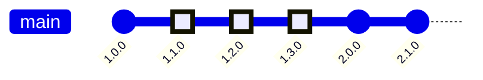

**Result:** `1.1.0`, `1.2.0`, `1.3.0`

**Why:** The segment starts at `>= 1.1.0` (inclusive) and ends at `< 2.0.0`
(exclusive). The history is linear so every version between those bounds on the
single branch is included.

**Real-world equivalents:**

| Ecosystem | Expression |
|-----------|-----------|
| npm | `">=1.1.0 <2.0.0"` |
| Python (PEP 440) | `>=1.1.0, <2.0.0` |
| Maven | `[1.1.0,2.0.0)` |
| NuGet | `[1.1.0,2.0.0)` |
| Cargo | `>=1.1.0, <2.0.0` |
| RubyGems | `'>= 1.1.0', '< 2.0.0'` |

**Same pattern, different notation:**

| Ecosystem | Expression | Notes |
|-----------|-----------|-------|
| npm | `^0` | `>=0.0.0 <1.0.0` — caret on bare `0` covers the entire pre-1.0 space |
| npm | `^0.2.3` | `>=0.2.3 <0.3.0` — caret locks the leftmost non-zero component; minor acts as major for 0.x |
| npm | `^0.0.3` | `>=0.0.3 <0.0.4` — caret on 0.0.x is effectively an exact pin |
| Cargo | `^0.2.3` | `>=0.2.3 <0.3.0` — same leftmost-non-zero rule as npm |
| Cargo | `^0.0.3` | `>=0.0.3 <0.0.4` — same exact-pin behavior as npm |
| npm | `"1.2.3 - 2.3"` | `>=1.2.3 <2.4.0` — partial upper bound in a hyphen range expands to the next increment, not the highest patch |
| PyPI (PEP 440) | `>=1.1.0, <2.0.0` | Post-release versions (`1.1.0.post1`) sort after `1.1.0` but before `1.1.1` — they are ordinary nodes in the linear order; a range that spans them needs no special syntax |
| OSV schema | `introduced: "1.1.0"`, `fixed: "2.0.0"` | `introduced` is inclusive (`>=`), `fixed` is exclusive (`<`); the fixed version itself is the first unaffected version |
| OSV schema | `introduced: "1.1.0"`, `limit: "2.0.0"` | `limit` is also exclusive (`<`), but semantically differs from `fixed`: it caps the evaluation range without implying a patch exists at that version |
| PyPI (PEP 440) | `===1.0` | Arbitrary equality: a degenerate segment `[1.0, 1.0]` with string comparison semantics — `===1.0` does not match `1.0.0`; the scheme is "exact string" rather than version ordering |
| Go modules | `v0.0.0-20210101000000-abcdefabcdef` | Pseudo-version: a synthetic semver string encoding a timestamp and commit hash for untagged commits; structurally an exact pin on a single node |
| OCI / container images | `sha256:abc123…` (digest) | Immutable content-addressed reference; always resolves to the same image — an exact pin by hash |

## Example 2: Single segment with filter

```
SEGMENT(
  scheme = semver,
  from >= 1.1.0,
  to < 2.0.0,
  filter = stable
)
```

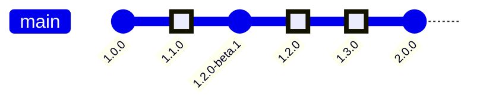

**Result:** `1.1.0`, `1.2.0`, `1.3.0`

**Why:** The bounds are the same as Example 1, but `filter = stable` removes
pre-release nodes. `1.2.0-beta.1` falls within the bounds but is excluded by
the filter.

**Real-world equivalents:**

| Ecosystem | Expression | Notes |
|-----------|-----------|-------|
| npm | `">=1.1.0 <2.0.0"` | Excludes pre-releases by default in resolution |
| Python (PEP 440) | `>=1.1.0, <2.0.0` | Pre-releases excluded by default unless explicitly requested |
| Cargo | `>=1.1.0, <2.0.0` | Pre-releases excluded from resolution by default |
| RubyGems | `'>= 1.1.0', '< 2.0.0'` | Pre-releases excluded by default |

**Same pattern, different notation:**

| Ecosystem | Expression | Notes |
|-----------|-----------|-------|
| npm | `^1.3.0-beta` | Admits pre-releases only where the `[major, minor, patch]` tuple matches the bound — `1.3.0-rc.1` is included but `1.4.0-rc.1` is not; the filter is tuple-scoped, not segment-wide |
| Cargo | `^1.3.0-beta` | Same tuple-scoped pre-release filter as npm |
| Composer | `~1.0@beta` | `>= 1.0, < 2.0` with filter `stability <= beta`; the `@beta` suffix overrides the project-wide minimum-stability for this constraint only — alpha releases are still excluded |
| Hex / Elixir | `~> 1.3` with `:allow_pre: true` | The `:allow_pre` flag lifts the pre-release filter for this constraint; without it, pre-releases are excluded even when within bounds |

## Example 3: Union of two disjoint segments

```
UNION(
  SEGMENT(scheme = semver, from >= 1.1.0, to < 1.3.0),
  SEGMENT(scheme = semver, from >= 2.0.0, to < 3.0.0)
)
```

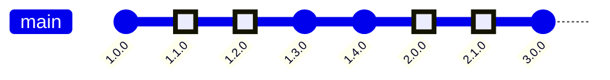

**Result:** `1.1.0`, `1.2.0`, `2.0.0`, `2.1.0`

**Why:** Each segment is evaluated independently and the results are combined.
The gap between `1.3.0` and `2.0.0` is not included — a union of two segments
does not imply anything about the versions between them.

**Real-world equivalents:**

| Ecosystem | Expression |
|-----------|-----------|
| Python (PEP 440) | `>=1.1.0, <1.3.0 \|\| >=2.0.0, <3.0.0` |
| npm | `">=1.1.0 <1.3.0 \|\| >=2.0.0 <3.0.0"` |
| OSV schema | Two separate `ranges` entries |
| NVD CPE | Two separate `versionStartIncluding`/`versionEndExcluding` pairs |

**Same pattern, different notation:**

| Ecosystem | Expression | Notes |
|-----------|-----------|-------|
| Maven | `[1.0,1.2),(1.4,2.0)` | Math interval notation; two disjoint ranges in a single expression using parentheses (exclusive) and brackets (inclusive) |

## Example 4: CVE spanning a version scheme switch and multiple parallel branches (Erlang/OTP)

A hypothetical CVE affects Erlang/OTP from the beginning of the R13 series all
the way through the current numeric release lines. It was fixed in:

- `R16B03-1` — the last R-series release (entire R13–R16 line is affected up
  to and including the fix)
- `26.2.5` on the `26.x` branch
- `27.1.1` on the `27.x` branch
- `28.0.1` on the `28.x` branch

The R-series and the numeric series use incompatible version schemes and share
no comparable version space, so they must be expressed as separate segments
under different schemes joined by UNION. Within the numeric series, the `26.x`,
`27.x`, and `28.x` lines are parallel branches that diverged from a common
ancestor, so they are expressed with FORK.

```
UNION(
  SEGMENT(
    scheme = otp-r-series,
    from >= R13B
  ),
  SEGMENT(scheme = otp, from >= 17.0, to < 26.0),
  FORK(26.0) {
    26.x: SEGMENT(scheme = otp, from >= 26.0, to < 26.2.5)
  },
  FORK(27.0) {
    27.x: SEGMENT(scheme = otp, from >= 27.0, to < 27.1.1)
  },
  FORK(28.0) {
    28.x: SEGMENT(scheme = otp, from >= 28.0, to < 28.0.1)
  }
)
```

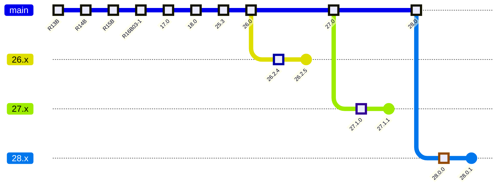

**Result:** All R13B and later releases in the R-series (no fix was ever issued); all 17.0 up to (not including) 26.0 on the main numeric line;
all 26.0–26.2.4 releases on the 26.x
branch; all 27.0–27.1.0 releases on the 27.x branch; all 28.0–28.0.0 releases
on the 28.x branch.

**Why:** Three structural features are at work here simultaneously.

First, the R-series and numeric releases use incompatible version schemes —
there is no comparator that can place `R16B03-1` and `17.0` in a common
ordering. They must be separate segments under separate schemes, joined by
UNION. The R-series segment has no upper bound because no fix was ever issued
for that line — every R-series release from R13B onwards is affected.

Second, within the numeric series, the vulnerability runs unbroken from `17.0`
through `25.3` on the main line. At `26.0`, `27.0`, and `28.0` the maintenance
branches fork off in turn. Each forked branch continues to be affected up to
its own fix point, expressed as a separate FORK. The fix in `26.2.5` does not
imply anything about `27.x` or `28.x` — each branch is independent.

Third, `25.x` reached end-of-life without receiving a patch. It is naturally
covered by the main segment (`to < 26.0`) — no special handling is needed. The
segment ends at the branch point, which implicitly includes everything up to
and before `26.0` regardless of what the last `25.x` patch was.

## Example 5: Elixir `~> 1.3` (stable lower bound)

The Elixir `~>` operator expresses a pessimistic version constraint. `~> 1.3`
translates to `>= 1.3.0 and < 2.0.0`, but crucially never includes pre-release
versions of the upper bound (`2.0.0-beta.1` is excluded), while pre-releases
within the range are included by default (`1.4.0-rc.1` is included). The lower
bound is stable, so `1.3.0-beta.1` is excluded.

Verified with [`Version.match?/3`](https://hexdocs.pm/elixir/Version.html#match?/3).

```
SEGMENT(
  scheme = semver,
  from >= 1.3.0,
  to < inf(2.0.0)
)
```

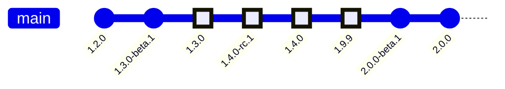

**Result:** `1.3.0`, `1.4.0-rc.1`, `1.4.0`, `1.9.9`

**Why:** The lower bound `>= 1.3.0` is a stable version, so `1.3.0-beta.1`
which sorts below `1.3.0` is excluded. The upper bound `< inf(2.0.0)` excludes
all `2.0.0` pre-releases regardless of any filter. Pre-releases within the
range (`1.4.0-rc.1`) are included because no filter is applied to the interior
of the segment.

**Real-world equivalents:**

| Ecosystem | Expression |
|-----------|-----------|
| Elixir | `~> 1.3` |
| npm | `^1.3.0` |
| Cargo | `^1.3` |
| RubyGems | `~> 1.3` |
| Python (PEP 440) | `~=1.3` |

**Same pattern, different notation:**

| Ecosystem | Expression | Notes |
|-----------|-----------|-------|
| PyPI (PEP 440) | `>=1.3, <2.0` | PEP 440 adds a `dev` release tier below `alpha`, so `inf(2.0.0)` in PEP 440 sits below `2.0.0.dev1`; the infimum concept is the same, the ordering ladder has one extra rung |
| RubyGems | `~> 1.3` | Two-component `~>` means `>= 1.3, < 2.0`; pre-release versions require explicit `>= 1.0.0.pre` |
| Hackage (PVP) | `>= 1.3 && < 1.4` | PVP uses two major components; `^>= 1.3.2` means `>= 1.3.2 && < 1.4` — the upper infimum is at the next minor |
| NuGet | `6.*` | `>= 6.0.0, < inf(7.0.0)` — wildcard suffix fixes the major and opens the rest; resolved to the highest matching version at restore time |
| Alpine / apk | `~=1.2` | `>= 1.2, < inf(1.3)` — fuzzy match operator ignoring the `_pN` packaging revision; same infimum upper bound structure |
| Alpine / apk | `_alpha`, `_beta`, `_rc`, `_p` suffixes | Scheme-internal pre/post-release ordering; `1.0_rc1 < 1.0 < 1.0_p1` — the infimum concept applies with Alpine-specific suffix names instead of semver pre-release labels |
| Gentoo portage | `~app-misc/foo-1.0` | Matches `1.0` and all packaging revisions (`1.0-r1`, `1.0-r2`, …) — equivalent to `>= 1.0, < inf(1.1)`; the `-rN` revision suffix is analogous to Debian's packaging revision |

## Example 6: Elixir `~> 1.3-beta` (pre-release lower bound)

`~> 1.3-beta` translates to `>= 1.3.0-beta and < 2.0.0`. The only difference
from Example 5 is that the lower bound is a pre-release version, which admits
`1.3.0-beta.1` into the range.

Verified with [`Version.match?/3`](https://hexdocs.pm/elixir/Version.html#match?/3).

```
SEGMENT(
  scheme = semver,
  from >= 1.3.0-beta,
  to < inf(2.0.0)
)
```

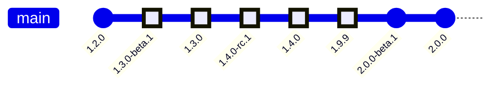

**Result:** `1.3.0-beta.1`, `1.3.0`, `1.4.0-rc.1`, `1.4.0`, `1.9.9`

**Why:** The lower bound is `>= 1.3.0-beta`, which in semver ordering sorts
before `1.3.0`. This admits `1.3.0-beta.1` into the range. Everything else
behaves identically to Example 5 — the upper bound `< inf(2.0.0)` still
excludes all `2.0.0` pre-releases, and pre-releases within the interior of the
segment remain included.

**Real-world equivalents:**

| Ecosystem | Expression | Notes |
|-----------|-----------|-------|
| Elixir | `~> 1.3-beta` | Exact equivalent; verified with `Version.match?/3` |
| npm | `^1.3.0-beta` | Similar, but npm excludes pre-releases from resolution by default unless the range itself contains a pre-release tag |
| Cargo | `^1.3.0-beta` | Similar behavior to npm |

**Same pattern, different notation:**

| Ecosystem | Expression | Notes |
|-----------|-----------|-------|
| Debian / APT | `1.0~beta1` | The `~` suffix causes a version to sort below the unsuffixed version; `1.0~beta1 < 1.0` — equivalent to a lower bound at `inf(1.0)` |
| RPM | `1.0~beta1` | Same tilde-before semantics as Debian in newer RPM versions |

## Example 7: Complement — excluding a specific bad version

A `1.x` release line where `1.2.3` was yanked due to a corrupt migration. All
other `1.x` releases are fine. The range is the full `1.x` segment minus the
single bad version.

```
COMPLEMENT(
  SEGMENT(scheme = semver, from = 1.2.3, to = 1.2.3),
  within = SEGMENT(scheme = semver, from >= 1.0.0, to < 2.0.0)
)
```

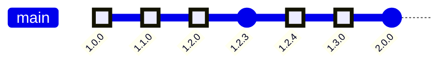

**Result:** All `1.x` versions except `1.2.3`

**Why:** COMPLEMENT subtracts the inner expression from the outer. The inner
segment selects exactly `1.2.3`; the outer segment is the full `1.x` line. The
result is everything in `1.x` except `1.2.3`. This is more precise than
splitting into two segments (`< 1.2.3` and `> 1.2.3`) because it does not
require knowing the version immediately before or after.

**Real-world equivalents:**

| Ecosystem | Expression |
|-----------|-----------|
| npm | `">=1.0.0 <1.2.3 \|\| >1.2.3 <2.0.0"` |
| Python (PEP 440) | `>=1.0.0, !=1.2.3, <2.0.0` |
| RubyGems | `'>= 1.0.0', '!= 1.2.3', '< 2.0.0'` |
| VERS | `vers:semver/>=1.0.0\|!=1.2.3\|<2.0.0` |

## Example 8: Intersection — safe and compatible

A dependency manager needs versions of `foo` that satisfy a compatibility
requirement (`~> 2.0`, meaning `>= 2.0.0` and `< 3.0.0`) AND are not in the
known-vulnerable range (`>= 2.1.0` and `< 2.2.0`).

```
INTERSECT(
  SEGMENT(scheme = semver, from >= 2.0.0, to < 3.0.0),
  COMPLEMENT(
    SEGMENT(scheme = semver, from >= 2.1.0, to < 2.2.0),
    within = SEGMENT(scheme = semver, from >= 2.0.0, to < 3.0.0)
  )
)
```

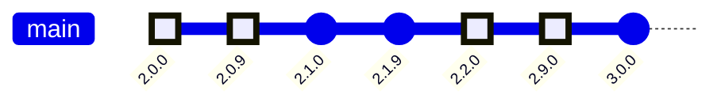

**Result:** `2.0.0`–`2.0.9`, `2.2.0`–`2.9.0`

**Why:** The intersection keeps only versions satisfying both constraints. The
vulnerable `2.1.x` range is removed by the COMPLEMENT. Everything else in
`2.x` survives.

## Example 9: Fork with no fix on an abandoned branch

A CVE is introduced at `1.3.0`. The `1.3.x` branch received a fix at `1.3.5`.
The `1.4.x` branch was abandoned before a fix was issued — every `1.4.x`
release is affected.

```
FORK(1.3.0) {
  1.3.x: SEGMENT(scheme = semver, from >= 1.3.0, to < 1.3.5),
  1.4.x: SEGMENT(scheme = semver, from >= 1.4.0)
}
```

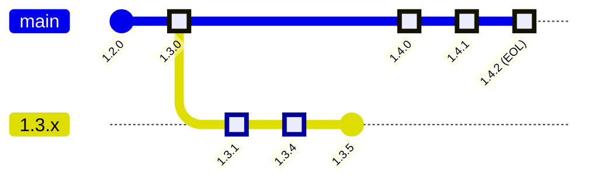

**Result:** `1.3.0`–`1.3.4` on the `1.3.x` branch; all of `1.4.x`

**Why:** The `1.4.x` segment has no upper bound — it is open-ended because no
fix was ever issued. The branch is in scope (it is listed in the FORK), but
every version on it is affected. This is distinct from omitting the branch
entirely, which would mean "out of scope for this advisory".

## Example 10: Orphan branch — disconnected roots

A repository has two completely unrelated histories: the main library tagged
with semver releases, and a `gh-pages` documentation branch created as an
orphan with its own independent tags. A range needs to cover affected versions
in both.

Since there is no shared ancestor, this cannot be expressed as a FORK. It is
a UNION of two segments under two different schemes.

```
UNION(
  SEGMENT(scheme = semver, from >= 1.0.0, to < 2.0.0),
  SEGMENT(scheme = git-tag, from >= docs-1.0, to < docs-2.0)
)
```

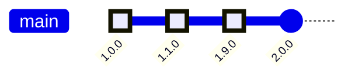

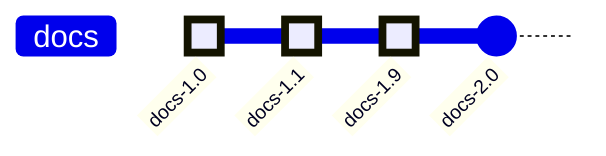

**Result:** `1.0.0`–`1.9.0` (semver); `docs-1.0`–`docs-1.9` (git-tag)

**Why:** FORK requires a shared ancestor node. When none exists, only UNION can
express membership across the two disconnected graphs. Each segment is
evaluated independently within its own scheme. A version in either set
satisfies the range.

**Same pattern, different notation:**

| Ecosystem | Expression | Notes |
|-----------|-----------|-------|
| Go modules | `example.com/foo` vs `example.com/foo/v2` | Major version suffix changes the module path, making v1 and v2 separate modules with no shared version space; a range spanning both requires two independent segments |
| Gentoo portage | `dev-libs/foo:2` vs `dev-libs/foo:3` | Each slot is an independent install target with its own version history; slots are simultaneously installable but have no shared version space — a range spanning two slots requires two independent segments |

## Example 11: Debian epoch bump

A Debian package for `libfoo` had its epoch bumped from `1` to `2` when
upstream reset their version counter. A vulnerability affects all versions from
`1:0.9.0-1` through `2:1.2.0-1` (the fix).

Without encoding the epoch, `1:99.9.9-1` would sort above `2:1.0.0-1` in
plain numeric comparison and appear to be outside the range — incorrectly.

```
SEGMENT(scheme = deb, from >= 1:0.9.0-1, to < 2:1.2.0-1)
```

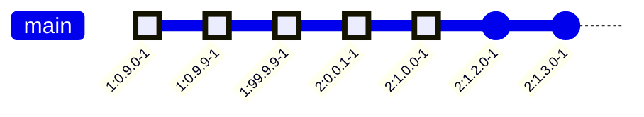

**Result:** All `1:*` versions from `1:0.9.0-1`; `2:0.0.1-1` through `2:1.1.x`

**Why:** The epoch is part of the version identity in the `deb` scheme, and
epoch comparison takes precedence over everything else: every `2:*` version
sorts above every `1:*` version. The ordering is therefore total across the
bump, and a single segment spans both epoch series — the two series are
separate counter spaces joined end-to-end by the epoch. A notation that strips
epochs and treats both as plain version strings would incorrectly place
`1:99.9.9-1` outside the range (it sorts above `2:1.0.0-1` numerically),
missing it entirely. The bump can equivalently be made explicit by splitting
at the epoch boundary into two segments joined by UNION — `[1:0.9.0-1,
2:0.0.1-1)` and `[2:0.0.1-1, 2:1.2.0-1)` — but the single segment is
sufficient.

**Real-world equivalents:**

| Ecosystem | Expression | Notes |
|-----------|-----------|-------|
| Debian / APT | `1:0.9.0-1` through `2:1.2.0-1` | Epoch prefix `N:` resets ordering; any `1:*` sorts below any `2:*` regardless of the version string |

**Same pattern, different notation:**

| Ecosystem | Expression | Notes |
|-----------|-----------|-------|
| PyPI (PEP 440) | `1!1.0 > 999.0` | Epoch prefix `N!` before the version; `1!0.1` sorts above any un-epoched version including `999.0` |
| RPM | `2:1.0-1` | Epoch is a separate integer field in the EVR tuple (`epoch:version-release`); same semantics as Debian |
| Arch Linux / ALPM | `2:1.0-1` | Same EVR structure as RPM; epoch comparison always takes precedence |

## Example 12: Version scheme switch — date-based to semver

A project versioned releases as `2021.01`, `2021.06`, `2022.03` (year.month)
before switching to semver at `1.0.0`. A vulnerability spans the transition.

```
UNION(
  SEGMENT(scheme = calver-ym, from >= 2021.01),
  SEGMENT(scheme = semver, from >= 1.0.0, to < 1.4.0)
)
```

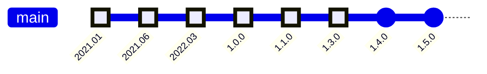

**Result:** All calver releases from `2021.01`; `1.0.0`–`1.3.0`

**Why:** The calver and semver version strings occupy incompatible ordering
spaces — `2021.01` cannot be compared to `1.0.0` using any shared comparator.
The transition is a hard break, expressed as two segments under two schemes
joined by UNION. The calver segment is open-ended because every calver release
predates the fix (which only exists in the semver line).

## Example 13: Open-ended prospective range

A package author declares that their library requires `foo >= 2.0.0` with no
upper bound — they trust that all future `2.x` and beyond releases will remain
compatible.

```
SEGMENT(
  scheme = semver,
  from >= 2.0.0,
  filter = stable
)
```

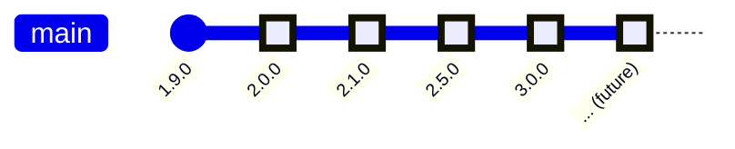

**Result:** All stable releases from `2.0.0` onwards, including future releases

**Why:** The segment has no upper bound — it is prospective. The author is
making an assumption about future releases: that anything `>= 2.0.0` will be
compatible. The `filter = stable` excludes pre-releases, which is the typical
default for dependency requirements. This is the simplest prospective range and
the one most package managers express natively. Its correctness depends entirely
on whether the version graph remains compatible beyond what the author can see.

**Real-world equivalents:**

| Ecosystem | Expression |
|-----------|-----------|
| npm | `">=2.0.0"` |
| Python (PEP 440) | `>=2.0.0` |
| Cargo | `>=2.0.0` |
| RubyGems | `'>= 2.0.0'` |
| Maven | `[2.0.0,)` |
| NuGet | `[2.0.0,)` |

## Example 14: Floating label

A package author declares a dependency on `latest` — a named label that the
registry resolves to the current highest stable release at the time the
dependency is evaluated.

```
NODE(
  scheme = npm,
  label = "latest"
)
```

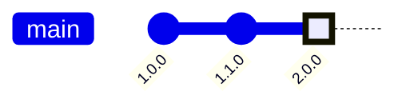

*At a later point in time, after `3.0.0` is published:*

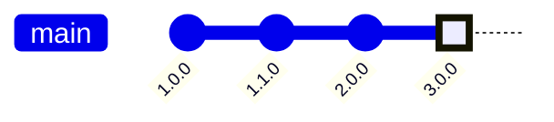

**Result:** Whichever node the registry currently associates with the label
`latest` — a single node, but not a fixed one.

**Why:** A floating label is a degenerate segment — it resolves to exactly one
node, but that node's identity is determined at evaluation time by an external
source (the registry), not by the version string itself. This is fundamentally
different from a pinned exact version like `[2.0.0, 2.0.0]`, whose identity is
fixed at authoring time. Two evaluations of the same floating label at different
points in time may return different nodes. No segment, bound, filter, or
infimum can express this — the primitive required is a named, externally
resolved pointer.

**Real-world equivalents:**

| Ecosystem | Expression | Notes |
|-----------|-----------|-------|
| npm | `"latest"` | Resolved against the registry's dist-tag at install time |
| npm | `"next"` | Same mechanism; points to the pre-release track |
| Composer | `"dev-main"` | Branch alias; resolves to the current tip of the `main` branch |
| Maven | `1.0-SNAPSHOT` | Mutable pointer; resolves to the latest snapshot artifact at build time, not a fixed version |
| OCI / container images | `latest`, `v1.0` (tags) | Image tags are mutable; the same tag can point to a different digest after a push — resolved at pull time against the registry |

## Example 15: Compound dependency requirement (OR, AND, exclusion)

A package author needs a version of `foo` that satisfies all of the following:

- Either the `1.x` LTS line **or** the `2.x` stable line (OR)
- But not the known-broken `1.2.x` range (exclusion)
- And within whichever line is chosen, only stable releases (AND with filter)

This is a realistic dependency requirement combining all three composition
operators.

**Step 1 — OR: accept either line**

```
UNION(
  SEGMENT(scheme = semver, from >= 1.0.0, to < 2.0.0, filter = stable),
  SEGMENT(scheme = semver, from >= 2.0.0, to < 3.0.0, filter = stable)
)
```

**Step 2 — exclusion: remove the broken range**

```
COMPLEMENT(
  SEGMENT(scheme = semver, from >= 1.2.0, to < 1.3.0),
  within = UNION(
    SEGMENT(scheme = semver, from >= 1.0.0, to < 2.0.0, filter = stable),
    SEGMENT(scheme = semver, from >= 2.0.0, to < 3.0.0, filter = stable)
  )
)
```

**Step 3 — AND: intersect with an additional lower-bound constraint**

A transitive dependency requires `foo >= 1.1.0`. The resolver must satisfy
both the author's range and the transitive constraint simultaneously:

```
INTERSECT(
  COMPLEMENT(
    SEGMENT(scheme = semver, from >= 1.2.0, to < 1.3.0),
    within = UNION(
      SEGMENT(scheme = semver, from >= 1.0.0, to < 2.0.0, filter = stable),
      SEGMENT(scheme = semver, from >= 2.0.0, to < 3.0.0, filter = stable)
    )
  ),
  SEGMENT(scheme = semver, from >= 1.1.0)
)
```

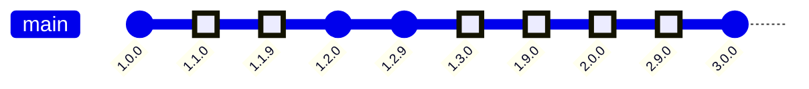

**Result:** `1.1.0`–`1.1.9`, `1.3.0`–`1.9.x`, `2.0.0`–`2.9.x`

**Why:** Each composition layer narrows the set independently. OR widens it
across two lines; COMPLEMENT punches out the broken range; INTERSECT narrows
it against a transitive constraint. Most package managers can express parts of
this but not all of it in a single range expression.

**Real-world equivalents:**

| Ecosystem | OR | Exclusion | AND / intersection | Notes |
|-----------|:--:|:---------:|:------------------:|-------|
| npm | ✓ `\|\|` | ✓ (split range) | ✗ (no explicit AND) | Exclusion requires writing two segments around the gap |
| Python (PEP 440) | ✓ (multiple specifiers) | ✓ `!=1.2.*` | ✓ (comma = AND) | Most expressive; full compound requirements in one expression |
| Elixir | ✓ `or` | ✓ `and != x` | ✓ `and` | Explicit `and`/`or` operators |
| Maven | ✓ (multiple ranges) | ✓ `(,1.2.0),(1.3.0,)` | ✓ (interval intersection) | Math interval notation supports gaps and intersections |
| Cargo | ✗ (no OR) | ✗ (no `!=`) | ✓ (comma = AND) | Cannot express OR across two lines in one constraint |
| RubyGems | ✗ (no OR) | ✓ `!= 1.2.x` | ✓ (multiple constraints) | No OR; intersection only |
| NuGet | ✗ (no OR) | ✗ (no `!=`) | ✓ (interval intersection) | Single range per dependency reference |

## Example 16: Unbounded range (any version)

A dependency declared with no version constraint — any version satisfies it.
This is the degenerate case of a segment with no lower and no upper bound.

```
SEGMENT(scheme = semver)
```

**Result:** Every version in the scheme.

**Why:** No bounds means no exclusions. The notation collapses to the identity
element for intersection — intersecting any range with this produces the
original range unchanged. It appears in practice wherever a dependency author
wants to express "I don't care about the version" or delegates version
selection entirely to the resolver.

In Maven, a bare `<version>1.0</version>` (soft requirement) is resolved as
an unbounded range with `1.0` as a hint to the resolver — the hint is outside
the range notation itself.

**Real-world equivalents:**

| Ecosystem | Expression | Notes |
|-----------|-----------|-------|
| npm | `*` or `""` | Empty string and `*` both mean any version |
| NuGet | `*` | Floating wildcard with no prefix resolves to any version |
| Conda | `*` | Glob wildcard covering all versions |
| Maven | `<version>1.0</version>` (soft) | Bare version string is a hint; resolver may pick any version |
| Cargo | (omit version field) | Omitting the version key in `Cargo.toml` means no constraint |
| OSV schema | `introduced: "0"` | Magic string meaning "from the beginning of time"; an open lower bound equivalent to an unbounded segment |

## Example 17: Implicit universe with exceptions

A vulnerability advisory declares that **all versions are affected by
default**, then lists the fixes as exceptions: `1.2.3` on the `1.x` branch
and `2.0.1` on the `2.x` line. Each fix and everything released after it on
its own branch is unaffected. The affected set is the entire version space
minus the exceptions — the complement of the fixed ranges within an implicit
unbounded range.

This inverts the usual model. Instead of enumerating what is included, the
author declares a default membership for the whole universe and enumerates
what is not.

```
COMPLEMENT(
  FORK(1.2.2) {
    1.x: SEGMENT(scheme = semver, from >= 1.2.3),
    2.x: SEGMENT(scheme = semver, from >= 2.0.1)
  },
  within = SEGMENT(scheme = semver)
)
```

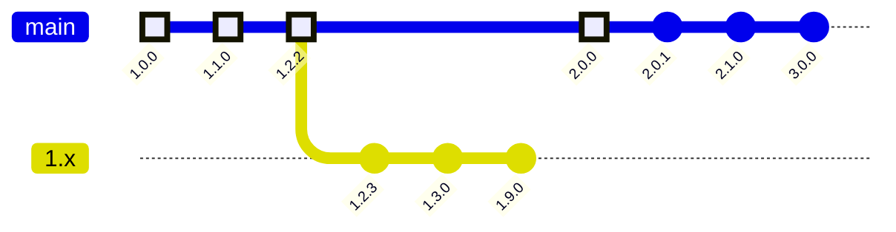

**Result:** `1.0.0`–`1.2.2` (the shared history) and `2.0.0` — everything
except `1.2.3` and later on the `1.x` branch and `2.0.1` and later on the
`2.x` line, including all future releases on either branch.

**Why:** The `within` of the COMPLEMENT is the unbounded segment (Example 16).
The excluded set must be branch-scoped: an unrestricted open-ended segment
`from >= 1.2.3` would also swallow `2.0.0`, which sorts above `1.2.3` but is
affected until `2.0.1`. The FORK restricts each exception to its own branch.
The key difference from Example 7 is that the `within` is the entire version
space rather than a named bounded range — the universe is implicit. A notation
that requires an explicit `within` cannot express this without first naming
the universe.

**Real-world equivalents:**

| Ecosystem | Expression | Notes |
|-----------|-----------|-------|
| CVE JSON v5 | `defaultStatus: "affected"` with `fixed` entries | Versions not listed are assumed affected; each `fixed` entry starts an unaffected range on its branch |
| RubyGems | `!= 1.2.3` | Exclusion from an implicit universe of all versions; the `within` is unstated |
| Python (PEP 440) | `!= 1.2.3` | Same — `!=` is COMPLEMENT within the implicit unbounded range |
| npm | `"!= 1.2.3"` (not standard, but `"* <1.2.3 || >1.2.3"` achieves it) | npm has no `!=`; exclusion requires writing around the gap explicitly |

## Constructs considered but not represented

These constructs were examined during research but do not map to any example
because they are not range-structural concepts — they concern distribution
policy, tooling behavior, or ordering details within a scheme rather than how
ranges are expressed or composed.

| Construct | Ecosystem | Why not an example |
|-----------|-----------|-------------------|
| Local version identifiers (`1.0+local`) | PyPI (PEP 440) | Explicitly excluded from index comparisons by policy; local builds are never published. Not a range concept — the identifier is stripped before any range evaluation occurs. |
| Version normalization (`1.0` == `1.0.0.0`) | NuGet | Scheme-internal equivalence rule; does not affect range structure. |
| 4-part versions (`1.0.0.0`) | NuGet | Fourth component extends the tuple but ordering remains linear; no structural novelty. |
| `+incompatible` suffix | Go modules | Flag appended to pre-modules packages that lack a `/vN` import path; a tooling migration artifact, not a range concept. |
| Minimum Version Selection (MVS) | Go modules | Resolver algorithm that picks the lowest satisfying version rather than the highest; the range is unchanged — this is a resolver policy choice, not range structure. |
| Mandatory upper bounds (PVP) | Hackage | Community convention requiring all library constraints to have an explicit upper bound; a policy on how ranges are authored, not a structural concept. |
| Dual version formats (`v1.2.3` vs `1.002003`) | CPAN / Perl | Two representations of the same version; a normalization concern within the scheme, not a range concept. |
| Comparison delegated to `version` module | CPAN / Perl | Comparison semantics depend on the installed module version; a tooling portability issue, not range structure. |
| Flutter SDK upper bounds ignored | Dart / pub | The pub tool silently ignores SDK upper bounds in some contexts; resolver policy, not range structure. |
| Caret forbidden in SDK constraints before Dart 2.19 | Dart / pub | Toolchain version restriction on syntax; not a range concept. |
| Yanked versions (Cargo) | Cargo | Yanked versions are excluded from fresh resolution but remain valid if already in a lockfile. The range is unchanged — this is resolver policy, not range structure. |
