# Version histories are graphs, not lines

Most version range notations treat versions as if they exist on a single
timeline: a total order where any two versions can be compared and one is
definitively "newer". In practice, real software projects produce version
histories that are **directed acyclic graphs (DAGs)**, not lines.

This document explores that reality through theory and concrete examples.

## The linear model and its assumption

The simplest mental model for versions is a straight line:

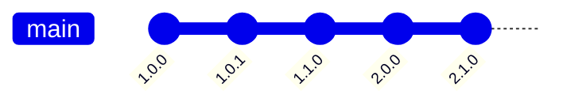

In this model, every version has exactly one predecessor and at most one
successor. Given any two versions A and B, you can always say which came
first. Comparators like `>=1.1.0` have a single, unambiguous meaning.

This assumption underlies nearly every version range notation in use today.

## The real model: a DAG

Real projects branch. A release can have **two successors** (the project
branches) or **two predecessors** (a merge). The result is a directed acyclic
graph where some pairs of versions are **incomparable** — neither is an
ancestor of the other.

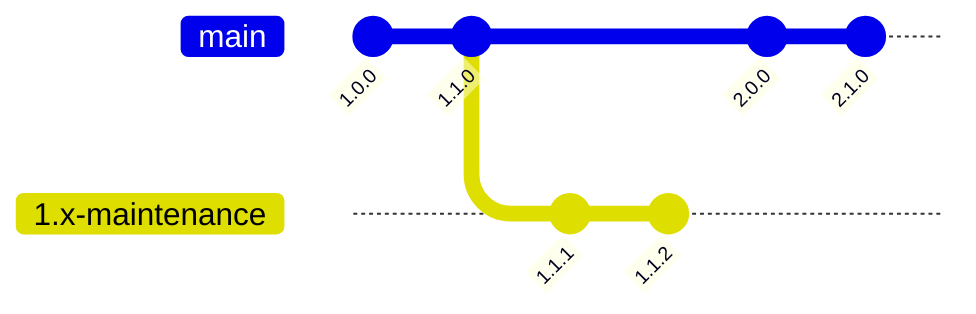

Here `1.1.2` and `2.1.0` are **incomparable**: neither descends from the
other. Asking "is `1.1.2` less than `2.1.0`?" is a question the version graph
cannot answer with a simple yes or no — it depends on what "less than" means
across a branch boundary.

## Simple example: a single maintenance branch

Consider a library that releases `2.0.0` and continues to maintain the `1.x`
line for users who cannot upgrade.

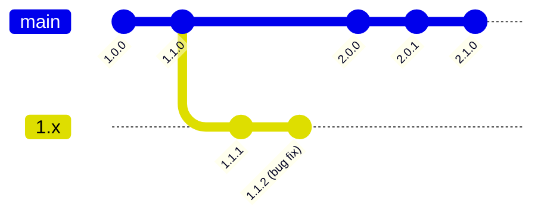

The bug fixed in `1.1.2` may or may not be present in `2.0.0`. The branches
diverged at `1.1.0`; changes made afterwards on one branch are independent of
the other unless explicitly ported. This is the fundamental property of a
graph: **reachability determines inheritance, not version number magnitude**.

## Complex examples

### Git branching and orphan branches

Git itself makes the DAG structure explicit. Every tag points to a commit, and
commits form a DAG. It is entirely valid — and common — for a repository to
contain **multiple root commits** with no shared ancestor.

A typical example is GitHub's `gh-pages` branch, which is created as an
[orphan branch](https://git-scm.com/docs/git-checkout#Documentation/git-checkout.txt---orphan)
with no relation to the main development history:

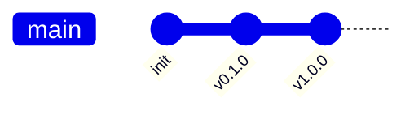

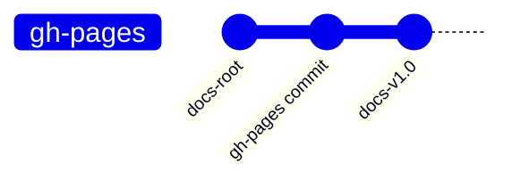

The tag `docs-v1.0` and the tag `v1.0.0` share no common ancestor. There is
no meaningful answer to "which came first?". Any version range notation that
maps tags to a line must either exclude one of these tags or invent an
arbitrary ordering.

This is not a theoretical edge case. Projects that vendor generated files,
store build artifacts, or maintain independent documentation trees in the same
repository routinely have disconnected histories.

### SemVer security patches on diverged branches: OpenSSL Heartbleed

[CVE-2014-0160](https://nvd.nist.gov/vuln/detail/CVE-2014-0160) (Heartbleed)
is one of the most studied vulnerabilities in open-source software. The
[OpenSSL release history](https://www.openssl.org/news/changelog.html) at the
time illustrates the branching problem clearly.

OpenSSL maintained **three parallel release lines** at the time of disclosure
(April 2014):

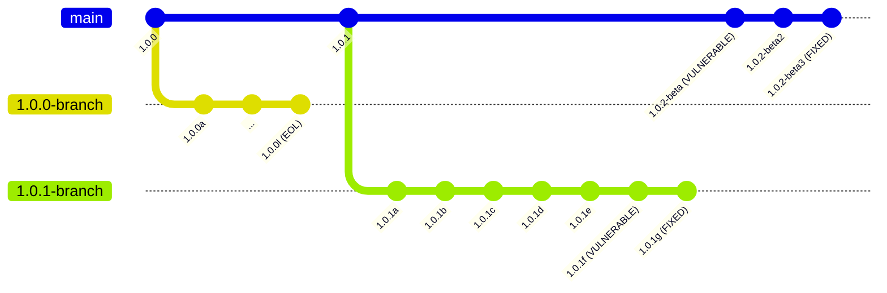

- The `1.0.0` branch was already past end-of-life and received no patch.
- The `1.0.1` branch was fixed in `1.0.1g`.
- The `1.0.2` beta series was fixed independently in a separate beta release.

The fix exists at a specific point on each branch independently. There is no
single version number threshold that cleanly separates vulnerable from
non-vulnerable across all branches:

- A threshold like `>=1.0.1g` incorrectly implies `1.0.2-beta` (which sorts
  above `1.0.1g` numerically) is safe, when in fact it was only fixed in
  `1.0.2-beta3`.
- No single comparator expression says anything meaningful about the `1.0.0`
  branch or any future branch.

### Linux kernel stable branches

The Linux kernel maintains multiple [Long-Term Support (LTS) branches](https://kernel.org/category/releases.html)
in parallel, each receiving independent security and bug-fix backports from
mainline:

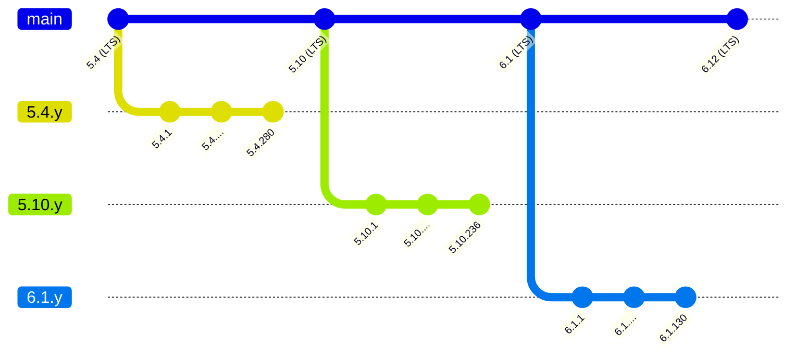

A CVE may be patched in `5.4.280` and `6.1.130` but **not** backported to
`5.10.y` due to a different code path, merge conflict, or oversight. The
affected set of versions is not a contiguous interval on any line — it is a
collection of sub-ranges, one per branch.

The kernel project itself tracks this via the
[linux-stable](https://git.kernel.org/pub/scm/linux/kernel/git/stable/linux.git)
repository and the [CVE tracking page](https://kernel.org/doc/html/latest/process/cve.html).

### Version scheme switch: Erlang/OTP

[Erlang/OTP](https://github.com/erlang/otp) changed its version numbering
scheme entirely in 2014, creating a discontinuity that cannot be bridged by
any single comparator.

**Before 2014:** releases followed the `R<major><letter><minor>` scheme:

```
R13B → R13B01 → R13B02 → R13B03 → R13B04
R14A → R14B → R14B01 → R14B02 → R14B03 → R14B04
R15A → R15B → R15B01 → R15B02 → R15B03
R16A → R16B → R16B01 → R16B02 → R16B03 → R16B03-1
```

**From 2014 onwards:** releases switched to a numeric scheme with two or more dot-separated parts (`<major>.<minor>`, extended with a patch part — and further parts as fixes land on already-patched older branches):

```
17.0 → 17.1 → 17.2 → 17.3 → 17.4 → 17.5
18.0 → 18.1 → 18.2 → 18.3
19.0 → 19.1 → 19.2 → 19.3
...
27.0 → 27.1 → 27.2 → 27.3
```

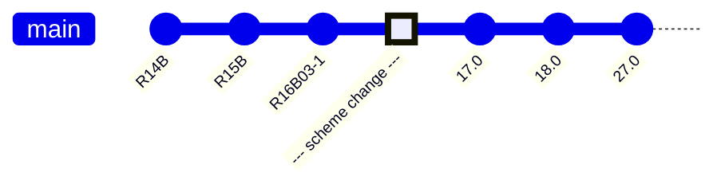

The full [Erlang/OTP release history](https://github.com/erlang/otp/releases)
is available on GitHub, and the [OTP versions tree](https://erlang.org/download/otp_versions_tree.html)
shows the branching structure visually. The
[OTP 17 announcement](https://www.erlang.org/news/74) explains the rationale
for the scheme change.

`R16B03-1` and `17.0` cannot be compared using a numeric comparator. They are
not just on different branches — they use incompatible versioning alphabets.
Any version range spanning the transition must either cover two separate
notations explicitly or define a custom mapping between them.

### Multiple independent release trains: Node.js

[Node.js](https://nodejs.org/en/about/previous-releases) maintains a
structured release policy where **even-numbered major versions** become LTS and
**odd-numbered major versions** are short-lived "Current" releases:

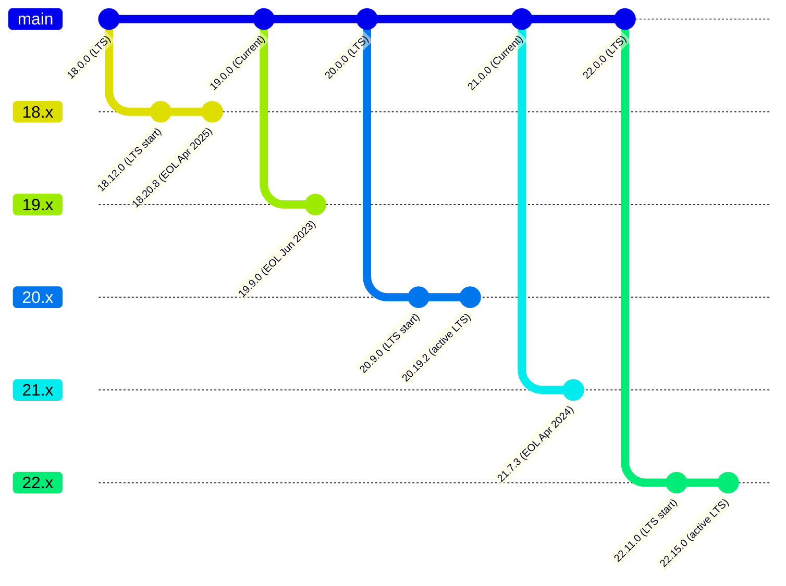

A hypothetical vulnerability present in Node.js 18.x, 19.x, 20.x, and 21.x
but fixed in 18.20.0, 20.12.0, and 22.0.0 (with 19.x and 21.x reaching EOL
before a patch was issued) cannot be expressed as a simple range. The fixes
are three separate points on three separate lines, and the affected set
spans four. The "safe" set is
not a contiguous region of any number line.

### Pre-release branches that never reconverge: OpenSSL 1.0.2 RC series

Release candidates complicate the graph further. When a project cuts an RC
from a branch, that branch may diverge from what eventually ships as the
final release.

[OpenSSL 1.0.2](https://www.openssl.org/news/changelog.html) went through
several release candidates before the final release:

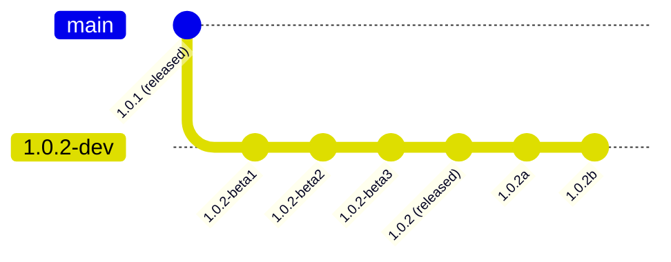

If a vulnerability is discovered after `1.0.2-beta3` is tagged but before
`1.0.2` is released, the RC tags are dead ends — they will never receive a
patch. They remain in the version graph at positions that sort between other
real releases, but they are not on any maintained branch.

A range intended to describe "vulnerable versions of the 1.0.2 line" must
either explicitly enumerate the RC tags or accept that they are stranded in
the graph with no forward path to a fix.

### Epoch bumps: Debian and RPM packaging

Linux distributions maintain their own version graph on top of upstream
releases. When a packaging mistake results in a version number that is too
high, or when upstream resets their version counter, packagers introduce an
**epoch** — a prefix integer that overrides all other comparisons.

In Debian, the version `2:1.0.0-1` always sorts above `1:99.9.9-1` regardless
of the rest of the version string. The epoch is not part of the upstream
version; it is metadata added by the distribution.

```
Upstream:   1.0.0 → 1.0.1 → ... → 99.0.0 → 1.0.0 (counter reset)
                                                ↓
Debian:     1:99.0.0-1 → ... → 1:99.9.9-1 → 2:1.0.0-1
```

This creates a situation where:

- The Debian version graph and the upstream version graph are **separate DAGs**
  connected only by the packaging process, not by version string ordering.
- Two Debian versions with different epochs are comparable within Debian's
  scheme, but their epoch-stripped strings are not comparable with upstream
  version strings or with packages from other distributions.
- A vulnerability fixed in upstream `1.0.1` may correspond to Debian
  `2:1.0.1-3~deb12u1`, which is not discoverable from the upstream version
  string alone.

The [Debian policy on version numbers](https://www.debian.org/doc/debian-policy/ch-controlfields.html#version)
and [RPM versioning](https://rpm-software-management.github.io/rpm/manual/spec.html#versioning)
both document epoch semantics. The epoch problem is directly relevant to
vulnerability databases that must map upstream CVE fix versions to distribution
package versions.

### Time vs. version order divergence: Python 2 and Python 3

Version numbers are commonly assumed to correlate with release time — a higher
version number means a later release. This breaks down when multiple major
lines are maintained simultaneously for extended periods.

[Python 2.7.18](https://www.python.org/downloads/release/python-2718/) was
released on **April 20, 2020** — more than a decade after Python 3.0 and
after Python 3.8.0 (October 2019). Numerically, `2.7.18 < 3.0.0`, but
`2.7.18` was released *after* `3.8.0`.

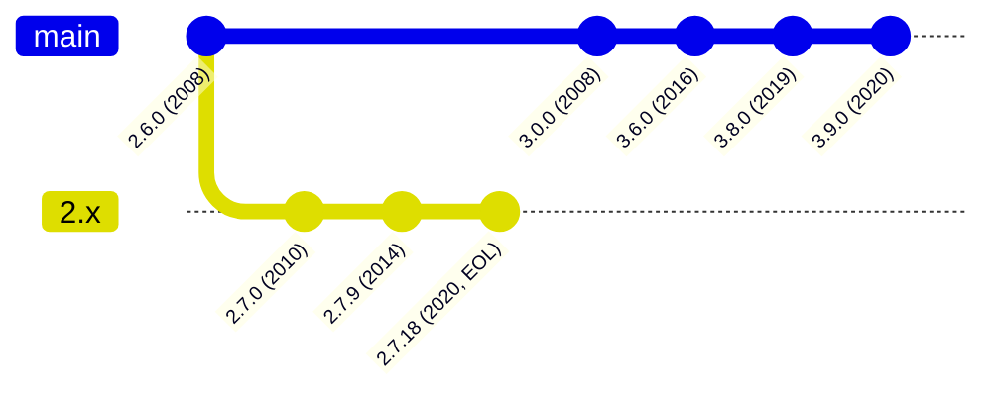

The [Python release history](https://www.python.org/doc/versions/) shows the
full timeline. Consequences:

- A security fix released in `2.7.18` (April 2020) is numerically "older"
  than `3.1.0` (June 2009), even though it was released eleven years later.
- Any reasoning of the form "versions above X are safe" collapses when the
  version number space is reused across incompatible major lines maintained
  in parallel.
- This is not unique to Python: the same pattern applies to Ruby 1.9/2.x,
  PHP 5/7/8, and any project that maintains an old major line past the release
  of multiple newer majors.

## Summary

Across all of these examples, the same structural reality appears:

- **Version histories are partial orders.** Some pairs of versions have a
  clear predecessor/successor relationship; others do not.
- **"Released after version X" only means later on the same branch.** It says
  nothing about other branches.
- **Two versions from different branches may be incomparable** — neither
  descends from the other, and imposing an ordering between them requires
  extra-graph information (release date, scheme convention, explicit mapping).
- **Version scheme switches** create hard discontinuities that no comparator
  can bridge within a single scheme.
- **Pre-release tags are dead ends** in the graph — they will never receive
  patches and sit at positions that interfere with range boundaries.
- **Epoch metadata** means that version ordering in distribution packages is
  not recoverable from the version string alone.
- **Version number order and release time order can diverge** when multiple
  major lines are maintained in parallel over long periods.

This document establishes the problem space. Use-case-specific implications —
such as how vulnerability affected ranges or dependency resolution interact
with this graph structure — are addressed in separate documents.
